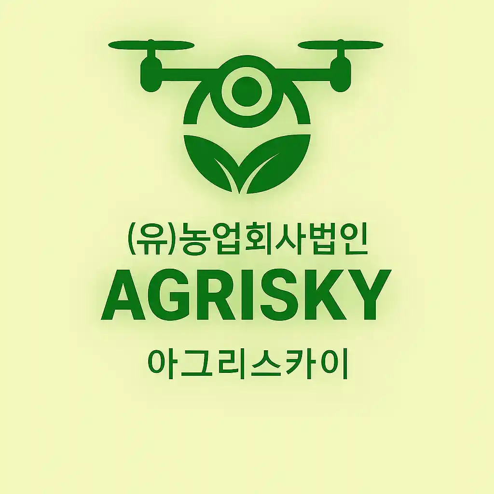

# 🌾 아그리스카이 (AGRISKY) - AI 기반 지능형 농업 드론 방제 플랫폼

<div align="center">



**AI 기술로 농업의 미래를 설계합니다**

[](http://agrisky.co.kr)
[](LICENSE)
[](https://www.typescriptlang.org/)
[](https://react.dev/)

</div>

---

## 📖 프로젝트 소개

**아그리스카이(AGRISKY)**는 AI 기반의 지능형 농업 드론 방제 작업 플랫폼입니다. 농지 조건, 기상 데이터, 드론 성능을 종합 분석하여 최적의 비행 경로를 자동 설계하고, 농가와 전문 드론 조작자를 지능적으로 매칭하여 효율적이고 정확한 농업 서비스를 제공합니다.

### 🎯 핵심 가치

- **🤖 AI 기반 최적화**: 머신러닝 알고리즘으로 비행 경로와 작업 일정을 자동 최적화
- **🌐 실시간 협업**: 다수의 드론 조작자가 참여하는 대규모 공동 방제 작업을 실시간으로 관리
- **🎯 지능형 매칭**: 농가의 방제 수요와 드론 조작자를 AI가 최적으로 매칭
- **📊 데이터 분석**: 비행 로그, 농약 살포량, 토양 상태 등을 수집·분석하여 지속적인 AI 고도화

---

## ✨ 주요 기능

### 1. 🚁 AI 비행 최적화 엔진
- 농지 조건, 기상 데이터, 드론 성능을 종합 분석하여 최적의 비행 경로 자동 설계
- **23% 비행시간 단축**, **18% 연료 효율성 향상**, **96% 커버리지 정확도** 달성

### 2. 👥 실시간 협업 관리
- 다수의 드론 조작자가 참여하는 대규모 공동 방제 작업을 실시간으로 모니터링
- 돌발 상황 즉시 대응 및 효율적 인력 배치

### 3. 🎯 지능형 작업 매칭
- 농가의 방제 수요와 드론 조작자를 AI가 최적으로 매칭
- **94% 매칭 정확도**, **평균 2시간 내 매칭** 달성
- 계약부터 결제까지 자동화된 원스톱 서비스

### 4. 📊 농업 데이터 분석
- 비행 로그, 농약 살포량, 토양 상태 등을 수집·분석
- 1,247개 비행 로그, 3,891개 기상 데이터, 567개 농지 정보 보유
- AI 기술 지속적 고도화를 위한 데이터 기반 학습

### 5. 🏡 농지 관리
- 농지 정보 등록 및 관리
- 농지별 방제 이력 추적
- 농지 상태 모니터링

### 6. 🛸 드론 관리
- 드론 정보 등록 및 관리
- 드론별 작업 이력 추적
- 드론 상태 모니터링

---

## 🛠️ 기술 스택

### Frontend
- **Framework**: React 18.3 + TypeScript 5.5
- **Build Tool**: Vite 5.4
- **UI Library**: 
  - Shadcn UI (Radix UI 기반)
  - Tailwind CSS 3.4
  - Lucide React (아이콘)
- **State Management**: React Context API
- **Routing**: React Router DOM 6.26
- **Charts**: Recharts 2.12
- **Forms**: React Hook Form + Zod

### Backend
- **Runtime**: Node.js
- **Framework**: Express.js 4.18
- **Database**: PostgreSQL
- **Authentication**: JWT (JSON Web Token)
- **Password Hashing**: bcryptjs
- **Language**: TypeScript 5.3

### DevOps & Infrastructure
- **Server**: AWS EC2 (Amazon Linux 2023)
- **Web Server**: Nginx (Reverse Proxy)
- **Process Manager**: PM2
- **Domain**: agrisky.co.kr
- **SSL**: Let's Encrypt (Certbot)

---

## 🚀 빠른 시작

### 사전 요구사항

- Node.js 18+ 
- PostgreSQL 14+
- npm 또는 yarn

### 설치 방법

1. **저장소 클론**
```bash
git clone https://github.com/Taeyong-oh/agrisky_platform.git
cd agrisky_platform
```

2. **프론트엔드 설정**
```bash
cd Platform_v1
npm install
npm run dev
```

3. **백엔드 설정**
```bash
cd ../server
npm install

# 환경 변수 설정
cp .env.example .env
# .env 파일을 편집하여 데이터베이스 정보 입력

# 데이터베이스 마이그레이션
psql -U your_user -d agrisky_platform -f migrations/create_tables.sql
psql -U your_user -d agrisky_platform -f migrations/create_auth_tables.sql

# 개발 서버 실행
npm run dev
```

4. **데모 계정 생성**
```bash
npm run create-demo-accounts
```

---

## 🎮 데모 계정

플랫폼을 체험해볼 수 있는 데모 계정이 준비되어 있습니다:

| 역할 | 이메일 | 비밀번호 | 설명 |
|------|--------|----------|------|
| 농가 | farmer@demo.com | demo123456 | 방제 작업을 요청하는 농가 계정 |
| 조작자 | operator@demo.com | demo123456 | 드론 방제 작업을 수행하는 조작자 계정 |
| 관리자 | admin@admin.com | admin1234 | 시스템 관리자 계정 |

**🌐 라이브 데모**: [http://agrisky.co.kr](http://agrisky.co.kr)

---

## 📸 스크린샷

### 랜딩 페이지


### 대시보드


### 작업 매칭


---

## 📈 성과 지표

- ✅ **1,200+** 완료된 작업
- ✅ **94%** 고객 만족도
- ✅ **23%** 효율성 향상
- ✅ **567** 등록 농지
- ✅ **94.2%** AI 모델 정확도
- ✅ **2시간** 평균 매칭 시간

---

## 🏗️ 프로젝트 구조

```
agrisky_platform/
├── Platform_v1/          # 프론트엔드 애플리케이션
│   ├── src/
│   │   ├── components/   # React 컴포넌트
│   │   ├── contexts/     # Context API
│   │   ├── lib/          # 유틸리티 및 API 클라이언트
│   │   └── ...
│   └── public/           # 정적 파일
├── server/               # 백엔드 애플리케이션
│   ├── src/
│   │   ├── routes/       # API 라우트
│   │   ├── config/       # 설정 파일
│   │   └── scripts/      # 유틸리티 스크립트
│   └── migrations/       # 데이터베이스 마이그레이션
├── deploy-to-server.sh   # 배포 스크립트
└── README.md
```

---

## 🔐 보안

- JWT 기반 인증 시스템
- bcryptjs를 사용한 비밀번호 해싱
- HTTPS 지원 (Let's Encrypt SSL)
- CORS 설정
- SQL Injection 방지 (Parameterized Queries)

---

## 🤝 기여하기

프로젝트에 기여하고 싶으신가요? 환영합니다!

1. Fork the Project
2. Create your Feature Branch (`git checkout -b feature/AmazingFeature`)
3. Commit your Changes (`git commit -m 'Add some AmazingFeature'`)
4. Push to the Branch (`git push origin feature/AmazingFeature`)
5. Open a Pull Request

---

## 📝 라이선스

이 프로젝트는 MIT 라이선스를 따릅니다. 자세한 내용은 `LICENSE` 파일을 참조하세요.

---

## 📞 문의

- **이메일**: admin@agrisky.co.kr
- **웹사이트**: [http://agrisky.co.kr](http://agrisky.co.kr)
- **GitHub Issues**: [Issues](https://github.com/Taeyong-oh/agrisky_platform/issues)

---

## 🙏 감사의 말

이 프로젝트는 다음과 같은 오픈소스 프로젝트들을 사용합니다:

- [React](https://react.dev/)
- [Vite](https://vitejs.dev/)
- [Shadcn UI](https://ui.shadcn.com/)
- [Express.js](https://expressjs.com/)
- [PostgreSQL](https://www.postgresql.org/)

---

<div align="center">

**⭐ 이 프로젝트가 도움이 되셨다면 Star를 눌러주세요! ⭐**

Made with ❤️ by AGRISKY Team

</div>

